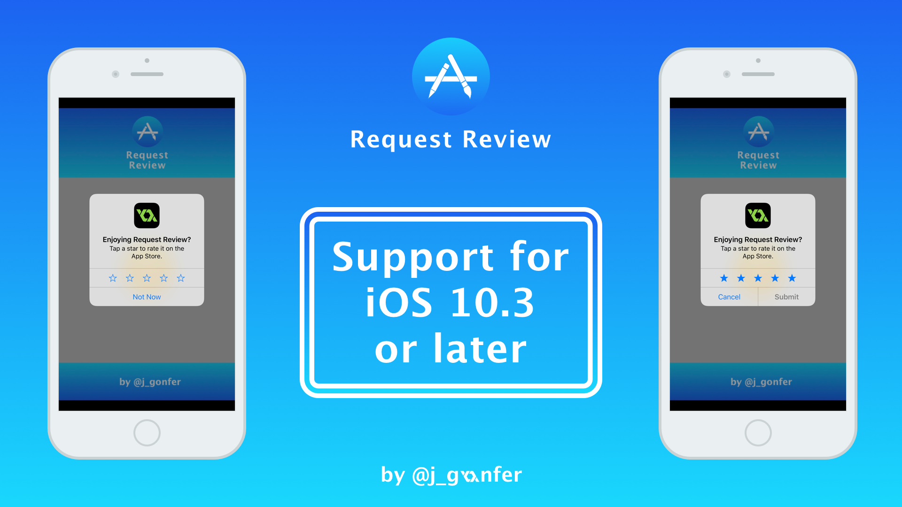
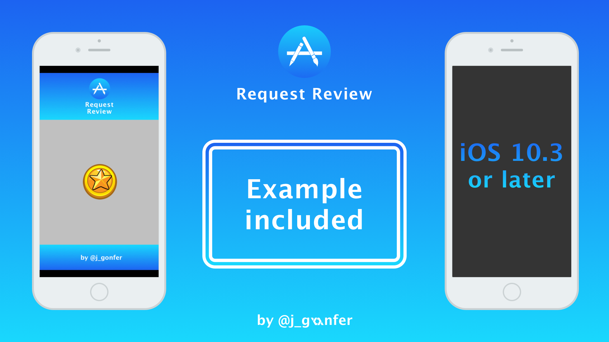

# Request Review Extension for iOS 10.3 or later #

This extension lets you use the new feature **[Request Review](https://developer.apple.com/reference/storekit/skstorereviewcontroller/2851536-requestreview)** added by Apple for **iOS 10.3**, which was released on March 27, 2017.

All you need to do is call the **request_review_app_store()** method, and the Extension will display an Alert Dialog to rate your game or app. If the device is running a version before 10.3, the method will return **0**. In the other hand, the method will return **1** if the Alert Dialog has been displayed.

Due to the Extension uses the last version of the **StoreKit.framework**, you'll need to build your game or app with **Xcode 10.3 or later**. If you try to build it with a version of Xcode before 10.3, it won't recognize the new method **requestReview**.

- Check this project in [Github](https://github.com/jgonfer/request-review-ios-10_3-gml) and learn how it's made.
- Follow me on [Twitter](https://twitter.com/j_gonfer) to get my last updates.

